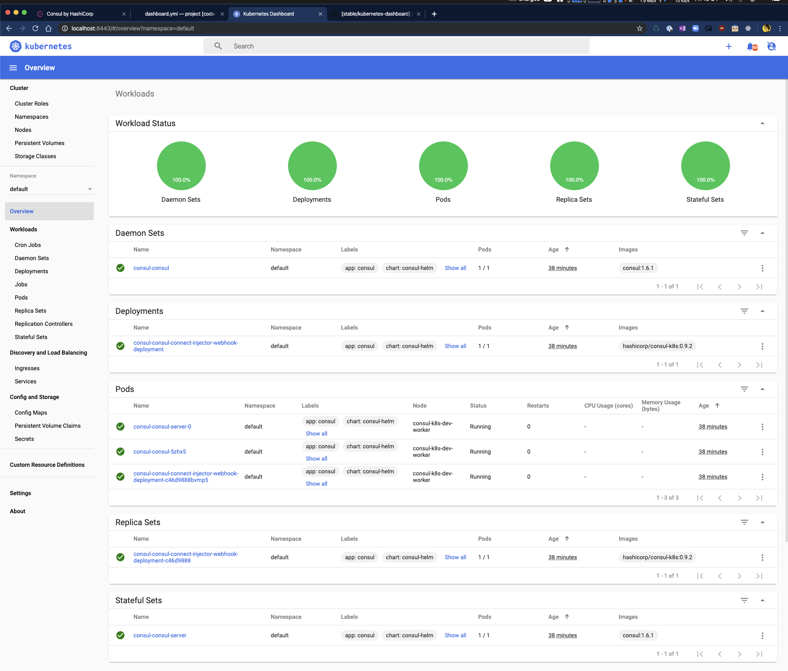

# Shipyard 
{: .fs-10}

**VERSION=0.5.2**

Shipyard allows you to create local Kubernetes clusters bootstrapped with and Consul and Vault.
{: .fs-6}

[View on Github](https://github.com/nicholasjackson/shipyard){: .btn .btn-purple }
{: .mb-lg-10}

To install Shipyard run the following command in your terminal:
{: .fs-6}

<div>
curl https://shipyard.demo.gs/install.sh | bash
</div>
{: .fs-8 .mb-lg-7}

Shipyard will download the latest version and install its configuration into `$HOME/.shipyard` and binary
file into `/usr/local/bin`.

```bash
➜ curl -sL https://shipyard.demo.gs/install.sh | bash

## Installing Shipyard Version: 0.1.10

#...

### Install application config to /Users/nicj/.shipyard

### Linking application to /usr/local/bin
#### You may be prompted for your password!###

## Instalation complete
To create a local Kubernetes and Consul cluster run:

yard up
```

# Demo

<iframe width="560" height="315" src="https://www.youtube.com/embed/jV8Jeuxb4ok" frameborder="0" allow="accelerometer; autoplay; encrypted-media; gyroscope; picture-in-picture" allowfullscreen></iframe>

# Quick Start
The following guide will show how to create a new cluster using Shipyard. Detailed info regarding all configurable options can be found in the [Creating Clusters](creating_clusters.html) doc.

## Creating a cluster
To create a Kubernetes cluster with Consul pre-installed use the following command:

```bash
➜ yard up

     _______. __    __   __  .______   ____    ____  ___      .______       _______
    /       ||  |  |  | |  | |   _  \  \   \  /   / /   \     |   _  \     |       \
   |   (----`|  |__|  | |  | |  |_)  |  \   \/   / /  ^  \    |  |_)  |    |  .--.  |
    \   \    |   __   | |  | |   ___/    \_    _/ /  /_\  \   |      /     |  |  |  |
.----)   |   |  |  |  | |  | |  |          |  |  /  _____  \  |  |\  \----.|  .--.  |
|_______/    |__|  |__| |__| | _|          |__| /__/     \__\ | _| `._____||_______/


Version: 0.1.10

## Creating K8s cluster in Docker and installing Consul

### Creating Kubernetes cluster, this process will take approximately 2 minutes

#### Create Kubernetes cluster in Docker using K3s

INFO[0000] Created cluster network with ID 187bedb47300f27fef59e33b2fef07270c4b397bd4df355e74ec6775a730738f
```

`yard up` will create a single node Kubernetes cluster using Rancher's `k3s` in a Docker container. Once the cluster has been created, it automatically installs `Consul` using the Helm chart with some sane defaults. The whole process takes around 60s once you have the cached the required Docker images.

Once complete you will see the following output in your terminal:

```bash
### Setup complete:

To interact with Kubernetes set your KUBECONFIG environment variable
export KUBECONFIG="$HOME/.shipyard/shipyard/kubeconfig.yml"

Consul can be accessed at: http://localhost:8500
Kubernetes dashboard can be accessed at: http://localhost:8443

To expose Kubernetes pods or services use the 'yard expose' command. e.g.
yard expose svc/myservice 8080 8080

When finished use "yard down" to cleanup and remove resources
```

## Interacting with your cluster

Shipyard automatically exports a Kubernetes config file to `$HOME/.shipyard/shipyard/kubeconfig.yml`, you can inspect the pods in the cluster by setting the environment variable `KUBECONFIG` to this path and then using `kubectl`:

```bash
➜ export KUBECONFIG="$HOME/.shipyard/shipyard/kubeconfig.yml"

➜ kubectl get pods
NAME                                                              READY   STATUS    RESTARTS   AGE
consul-consul-connect-injector-webhook-deployment-c46d9888cm7j5   1/1     Running   0          9m14s
consul-consul-server-0                                            1/1     Running   0          9m13s
consul-consul-w4nqw                                               1/1     Running   0          9m14s
```

The Consul server API is accessible at `http://localhost:8500` which is the default address used by the `consul` CLI.

```bash
➜ consul members
Node                    Address          Status  Type    Build  Protocol  DC   Segment
consul-consul-server-0  10.42.0.10:8301  alive   server  1.6.1  2         dc1  <all>
k3d-shipyard-server     10.42.0.5:8301   alive   client  1.6.1  2         dc1  <default>
```

## Consul UI and CLI
By default Shipyard exposes the Consul UI at the following URL [http://localhost:8500/ui/](http://localhost:8500/ui/)


This URI is also the default for the Consul CLI:

```
➜ consul members
Node                    Address          Status  Type    Build  Protocol  DC   Segment
consul-consul-server-0  10.42.0.10:8301  alive   server  1.6.1  2         dc1  <all>
k3d-shipyard-server     10.42.0.6:8301   alive   client  1.6.1  2         dc1  <default>
```

## Kubernetes Dashboard and kubectl
Shipyard exposes the Kubernetes API server locally and exports the required Kubernetes config file to the path `$HOME/.shipyard/shipyard/kubeconfig.yml`. To use Shipyard and `kubectl` you can set the  environment variable `KUBECONFIG` to this path and use `kubectl` as normal.

```
➜ export KUBECONFIG=$HOME/.shipyard/shipyard/kubeconfig.yml

➜ kubectl get pods
NAME                                                              READY   STATUS    RESTARTS   AGE
consul-consul-connect-injector-webhook-deployment-c46d9888gqz9s   1/1     Running   0          14m
consul-consul-server-0                                            1/1     Running   0          14m
consul-consul-jsjmn                                               1/1     Running   0          14m
```

The Kubernetes dashboard is also available by default at [http://localhost:8443](http://localhost:8443), authentication has been disabled for this.



## Deleting your cluster
Once you have finished with your cluster it can be deleted with the following command:

```
➜ yard down

     _______. __    __   __  .______   ____    ____  ___      .______       _______
    /       ||  |  |  | |  | |   _  \  \   \  /   / /   \     |   _  \     |       \
   |   (----`|  |__|  | |  | |  |_)  |  \   \/   / /  ^  \    |  |_)  |    |  .--.  |
    \   \    |   __   | |  | |   ___/    \_    _/ /  /_\  \   |      /     |  |  |  |
.----)   |   |  |  |  | |  | |  |          |  |  /  _____  \  |  |\  \----.|  .--.  |
|_______/    |__|  |__| |__| | _|          |__| /__/     \__\ | _| `._____||_______/


Version: 0.1.13

## Stopping Kubernetes and cleaning resources
INFO[0000] Removing cluster [shipyard]
INFO[0000] ...Removing server
INFO[0001] ...Removing docker image volume
INFO[0001] Removed cluster [shipyard]
```
